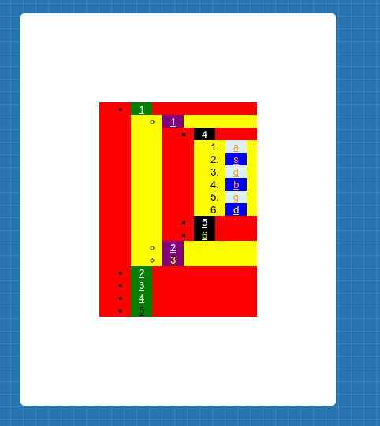

### Задание:
-----
* Необходимо без использование классов и идентификаторов (в html код ничего не добавляем) с помощью css воссоздать данное изображение.
* Есть [кусочек html-кода](html-code.html) и картинка.

